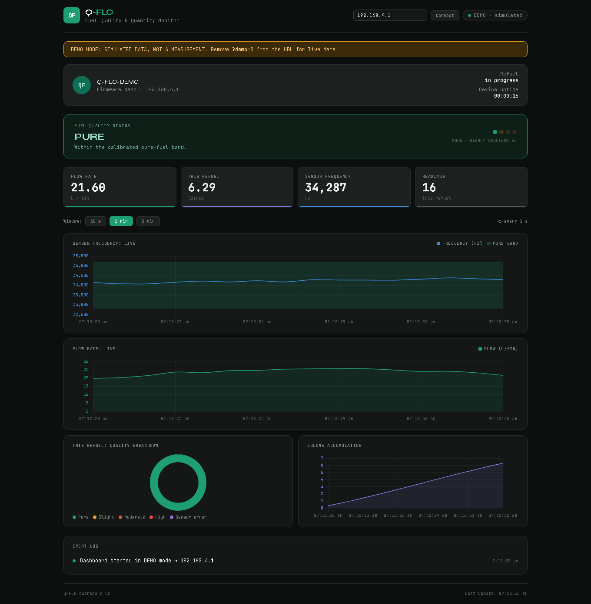
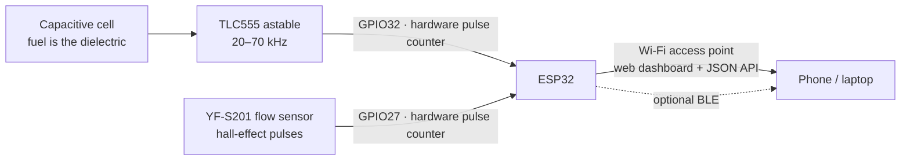
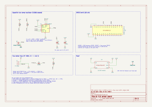

# Q-Flo: fuel quality and quantity monitor (prototype v1)


An ESP32-based prototype that checks **fuel quality** by capacitive (dielectric) sensing and
measures **fuel quantity** with a flow sensor, then shows both live on a phone or laptop over
Wi-Fi. Built as a B.Tech Electronics and Communication Engineering mini project.



## Why

Adulterated fuel and short delivery at filling stations are hard for a driver to spot. Q-Flo
explores a low-cost way to watch both while fuel flows: petrol and its common adulterants have
different dielectric constants, so the capacitance of a small sensing cell changes with what's
flowing through it, while a flow meter counts the litres.

## How it works



- **Quality.** The cell is the timing capacitor of a 555 oscillator: `f = 1.44 / ((R_A + 2·R_B)·C)`.
  A change in the fuel's dielectric constant shifts the frequency. The firmware compares it
  with a band recorded from pure fuel and classifies each reading as **pure**, **slightly**,
  **moderately** or **highly adulterated**, or flags a sensor fault.
- **Quantity.** The YF-S201 gives about 450 pulses per litre (7.5 Hz per L/min). The firmware
  turns pulses into flow rate and litres per refuelling session.
- **Output.** The ESP32 runs its own Wi-Fi access point and serves a live dashboard and a JSON
  API. Readings can also go out over BLE (set `QFLO_ENABLE_BLE` to 1 in `config.h`).

## Features

- Both signals counted by the ESP32's **PCNT hardware counters**, so the main loop never blocks
  and keeps up with a 70 kHz oscillator while Wi-Fi runs.
- 200 ms frequency gate with a **median filter**; flow rate from the real window length.
- **Refuelling sessions** that start and stop on flow; quality is only judged while fuel flows,
  so an empty chamber can't raise a false alarm.
- **One-touch calibration**: 10 s of readings from pure fuel set the band (mean ± 3σ, at least ±3 %).
- Settings kept in **flash (NVS)**; a **serial console** for status, calibration and CSV logging.
- A **self-contained web dashboard** served by the device (works without internet), plus a
  richer [external dashboard](dashboard/index.html) with charts and an event log.

## Hardware

| Part | Role |
|------|------|
| ESP32 DevKit (ESP32-WROOM-32) | Pulse counting, classification, Wi-Fi/BLE, web server |
| TLC555 (CMOS 555) at 3.3 V | Astable oscillator; the sensing cell is its timing capacitor |
| Capacitive sensing cell | Two plates in the fuel path |
| YF-S201 hall-effect flow sensor | Flow rate and volume |
| BAT85 + 10 kΩ | Level-shifts the 5 V flow signal to 3.3 V |



KiCad files are in [`hardware/kicad`](hardware/kicad). Wiring, the pin map and component
notes are in [`docs/HARDWARE.md`](docs/HARDWARE.md).

## Getting started

1. **Arduino IDE 2** → Boards Manager → install **esp32 by Espressif Systems** (3.x).
2. Open [`firmware/qflo/qflo.ino`](firmware/qflo/qflo.ino).
3. *(Optional)* copy `secrets.example.h` to `secrets.h` to set your own access-point password
   or join an existing network. `secrets.h` is git-ignored.
4. Board **ESP32 Dev Module** → Upload. Serial monitor at 115200 baud; type `help`.
5. Join the Wi-Fi network **`Q-FLO-XXXX`** (default password `qflo1234`, change it in
   `secrets.h`) and open **http://192.168.4.1**.
6. With pure fuel flowing, run a calibration from the dashboard (or type `cal` in the serial monitor).

The external dashboard: open [`dashboard/index.html`](dashboard/index.html) in a browser.
It connects to `192.168.4.1` by default; add `?device=<ip>` for another address, or `?demo=1`
to see it with simulated data.

## Repository layout

```
firmware/qflo/     ESP32 firmware (Arduino): main loop, sessions, calibration, web API
dashboard/         External web dashboard (single HTML file)
hardware/kicad/    KiCad schematic and libraries
docs/              Hardware notes, calibration procedure, device API
original/          The original mini-project sketches, as demonstrated
images/            Dashboard screenshot and schematic
```

## Limitations and lessons learned

This is a bench prototype, not a product.

- The plates add only 1–2 pF against ~20 pF of stray capacitance, so wiring and temperature
  move the reading. A larger, shielded stainless-steel cell and a capacitance-to-digital
  converter would make the fuel term dominate.
- There's no temperature compensation, and one calibrated band stands in for a proper
  multi-sample calibration.
- The YF-S201 is a water flow sensor: fine for bench demos, not rated for petrol.
- Copper electrodes react with fuel; stainless steel is the right material.

## Safety

Petrol vapour is explosive at very low concentrations. Test outdoors with small volumes, no
ignition sources and an extinguisher at hand. Never power the prototype inside a vehicle's
fuel system.

## Team

B.Tech ECE mini project, MBCET (2026), built by a team of five. Maintained by
[Adwaith A S](https://github.com/adwaithas-2004).

## License

© 2026 the Q-Flo team. All rights reserved; shared for viewing and evaluation. See [LICENSE](LICENSE).
